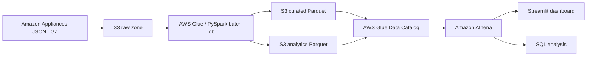

# Amazon Appliances Reviews Data Lake

An end-to-end batch data engineering project for the Amazon Reviews 2023
Appliances dataset. The pipeline reads compressed JSON Lines from Amazon S3,
cleans and models the data with PySpark, writes analytics-ready Parquet datasets,
catalogs them with AWS Glue, queries them through Amazon Athena, and presents the
results in a Streamlit dashboard.

## Architecture



The project uses one Spark job to produce all six final datasets and one Glue
crawler to register them in the Data Catalog.

## What the project does

- Applies explicit Spark schemas to the review and product metadata files.
- Validates ratings, prices, counts, timestamps, and product identifiers.
- Creates a stable SHA-256 review ID and removes duplicate reviews.
- Joins reviews to product metadata using `parent_asin`.
- Preserves reviews without matching product metadata through a left join.
- Writes Snappy-compressed Parquet, partitioning review-level data by year.
- Pre-aggregates product, brand, and monthly summaries to reduce Athena scans.
- Provides validation and analysis SQL for Athena.
- Displays overall metrics, rating distribution, leading products, brand
  performance, monthly trends, and price-band analysis in Streamlit.

## Repository layout

```text
.
├── spark_jobs/
│   └── process_amazon_data.py   # PySpark cleaning and transformation job
├── athena/
│   ├── validation_queries.sql   # Data-quality and reconciliation checks
│   └── analytics_queries.sql    # Reusable business-analysis queries
├── dashboard/
│   └── app.py                   # Streamlit dashboard backed by Athena
├── docs/
│   └── aws_setup.md             # Detailed AWS console and IAM instructions
├── config.example.py            # Non-secret dashboard configuration template
├── requirements.txt             # Python dependencies
└── README.md
```

The two source archives are expected to be named:

```text
Appliances.jsonl.gz
meta_Appliances.jsonl.gz
```

Download them from the official Amazon Reviews 2023 dataset:

| File | Download |
|---|---|
| `Appliances.jsonl.gz` | [Download appliance reviews](https://mcauleylab.ucsd.edu/public_datasets/data/amazon_2023/raw/review_categories/Appliances.jsonl.gz) |
| `meta_Appliances.jsonl.gz` | [Download appliance metadata](https://mcauleylab.ucsd.edu/public_datasets/data/amazon_2023/raw/meta_categories/meta_Appliances.jsonl.gz) |

The complete dataset catalog is available on the [McAuley Lab Amazon Reviews
2023 website](https://amazon-reviews-2023.github.io/).

## Data flow

The Spark job expects this raw S3 layout:

```text
s3://YOUR_BUCKET/
└── raw/
    ├── reviews/
    │   └── Appliances.jsonl.gz
    └── metadata/
        └── meta_Appliances.jsonl.gz
```

It creates the following outputs:

| Dataset | S3 prefix | Grain | Partitioning |
|---|---|---|---|
| `reviews` | `curated/reviews/` | One cleaned review | `review_year` |
| `products` | `curated/products/` | One product | None |
| `review_product` | `curated/review_product/` | One enriched review | `review_year` |
| `product_summary` | `analytics/product_summary/` | One product | None |
| `brand_summary` | `analytics/brand_summary/` | One brand | None |
| `monthly_review_summary` | `analytics/monthly_review_summary/` | One review month | `review_year` |

The job uses overwrite mode. Running it again replaces the existing curated and
analytics outputs.

## Main transformation rules

### Reviews

- Uses `parent_asin` as the product key and falls back to `asin` when needed.
- Accepts ratings from 1 through 5; invalid values become null.
- Converts the source epoch-millisecond timestamp to UTC.
- Places missing or invalid timestamps in `review_year=0` and marks the month as
  `unknown`.
- Converts invalid or negative helpful-vote counts to zero.
- Defaults missing purchase-verification values to `false`.
- Generates `review_id` from product, user, timestamp, title, and text fields.

### Products

- Uses `parent_asin` as the unique product key.
- Converts missing or blank store values to the brand `Unknown`.
- Removes dollar signs and commas before converting valid non-negative prices.
- Accepts metadata ratings from 1 through 5.
- Converts invalid or negative metadata review counts to zero.

### Analytics

- Product summaries contain review volume, average rating, verification counts,
  helpful votes, price, and metadata statistics.
- Brand summaries combine product counts and average price with review metrics.
- Monthly summaries contain counts, rating totals and distribution, purchase
  verification counts, and distinct reviewed products.

## Prerequisites

- An AWS account with access to S3, AWS Glue, Athena, and IAM.
- AWS credentials supplied through an IAM role, AWS CLI profile, or the standard
  AWS environment variables.
- Python and the packages in `requirements.txt`.
- Java and a Spark distribution when running the PySpark job locally. AWS Glue
  supplies the managed Spark runtime when the job runs there.
- The Amazon Reviews 2023 Appliances review and metadata archives.

Keep the S3 bucket, Glue database, crawler, Athena workgroup, and dashboard in
the same AWS Region unless you intentionally configure a cross-region setup. The
project defaults to `ap-south-1`.

## Install the project

Create and activate a virtual environment, then install the dependencies:

```bash
python -m venv .venv
source .venv/bin/activate
python -m pip install --upgrade pip
python -m pip install -r requirements.txt
```

Configure AWS credentials outside the repository. For example:

```bash
aws configure --profile amazon-appliances
```

Do not place AWS access keys in Python files or commit credential exports.

## Set up AWS

The complete console walkthrough, IAM requirements, crawler settings, and
cleanup steps are in [`docs/aws_setup.md`](docs/aws_setup.md).

The essential workflow is summarized below.

### 1. Create an S3 bucket

Create a private bucket in `ap-south-1` with public access blocked and default
encryption enabled. Replace `YOUR_BUCKET` in every command with its globally
unique name.

### 2. Upload the raw files

```bash
aws s3 cp Appliances.jsonl.gz \
  s3://YOUR_BUCKET/raw/reviews/Appliances.jsonl.gz

aws s3 cp meta_Appliances.jsonl.gz \
  s3://YOUR_BUCKET/raw/metadata/meta_Appliances.jsonl.gz
```

### 3. Run the Spark job

For AWS Glue, upload `spark_jobs/process_amazon_data.py`, create a Spark ETL job,
grant its role read/write access to the project bucket, and add this job
parameter:

| Key | Value |
|---|---|
| `--bucket` | `YOUR_BUCKET` |

The value must be the bucket name only, without `s3://`.

For a local Spark installation that includes the appropriate S3A dependencies:

```bash
spark-submit spark_jobs/process_amazon_data.py \
  --bucket YOUR_BUCKET \
  --region ap-south-1
```

The bucket can alternatively be supplied as `DATA_LAKE_BUCKET`; the region can
be supplied as `AWS_REGION`.

### 4. Catalog the Parquet datasets

Create the Glue database `amazon_appliances`, then create one on-demand crawler
with these six S3 targets:

```text
s3://YOUR_BUCKET/curated/reviews/
s3://YOUR_BUCKET/curated/products/
s3://YOUR_BUCKET/curated/review_product/
s3://YOUR_BUCKET/analytics/brand_summary/
s3://YOUR_BUCKET/analytics/product_summary/
s3://YOUR_BUCKET/analytics/monthly_review_summary/
```

Use one schema per S3 path and leave the table prefix empty. The expected table
names are:

```text
reviews
products
review_product
brand_summary
product_summary
monthly_review_summary
```

Run the crawler again after a schema or partition change.

### 5. Configure and query Athena

In Athena, select the `amazon_appliances` database and configure a query-result
location such as:

```text
s3://YOUR_BUCKET/athena-query-results/
```

Run statements from these files one at a time:

- [`athena/validation_queries.sql`](athena/validation_queries.sql) checks table
  presence, row counts, identifiers, uniqueness, valid values, join coverage,
  partitions, and summary reconciliation.
- [`athena/analytics_queries.sql`](athena/analytics_queries.sql) contains the
  project analysis queries.

Athena may catalog the `review_year` partition as a string. Use quoted values in
partition filters, for example `WHERE review_year = '2023'`.

## Run the dashboard

Copy the example configuration and replace the placeholder bucket name:

```bash
cp config.example.py config.py
```

The dashboard reads environment variables first and falls back to `config.py`.

| Setting | Required | Default or purpose |
|---|---:|---|
| `AWS_REGION` | No | `ap-south-1` |
| `ATHENA_DATABASE` | No | `amazon_appliances` |
| `ATHENA_OUTPUT_LOCATION` | Yes | S3 URI for Athena query results |
| `ATHENA_WORKGROUP` | No | `primary` |
| `AWS_PROFILE` | No | Optional named AWS CLI profile |

Start the app from the project root:

```bash
streamlit run dashboard/app.py
```

The dashboard waits up to 120 seconds for each Athena query and caches completed
results for five minutes. Use Streamlit's cache controls or restart the app when
you need to force a refresh after rebuilding the data.

## Validate the pipeline

After the Spark job and crawler complete:

1. Confirm that all six expected tables appear in the Glue Data Catalog.
2. Run `athena/validation_queries.sql`.
3. Confirm that missing IDs, duplicate IDs, invalid values, and summary-count
   differences are zero.
4. Review the unmatched-product count; unmatched reviews are retained by design.
5. Open the dashboard and compare its headline totals with the Athena results.

The Python modules can be syntax-checked locally with:

```bash
python -m py_compile \
  spark_jobs/process_amazon_data.py \
  dashboard/app.py \
  config.example.py
```

## IAM summary

The Spark job role needs list, read, write, and delete access on the project
bucket because the job overwrites its outputs. The crawler role needs read
access to the curated and analytics prefixes plus Glue service permissions.

The dashboard identity needs permission to:

- start, inspect, read, and stop Athena queries;
- read the Glue database, tables, and partitions;
- read the cataloged Parquet objects;
- read and write the configured Athena results prefix.

Use bucket-scoped permissions and separate job and dashboard identities when
possible. See [`docs/aws_setup.md`](docs/aws_setup.md) for the detailed list.

## Cost controls

- Keep the Glue job and crawler on demand.
- Query the analytics summaries instead of review text when detail is unnecessary.
- Filter `reviews` and `review_product` by `review_year` where possible.
- Keep dashboard caching enabled.
- Remove old Athena result objects periodically.
- Delete the AWS resources when the project is no longer in use.

## Known limitations

- This is a batch pipeline; changes appear only after rerunning the Spark job and
  crawler.
- Product deduplication keeps one metadata row per `parent_asin` without applying
  a source-quality ranking.
- The generated review ID is deterministic but is not an identifier supplied by
  the source dataset.
- Unknown timestamps remain queryable in the `review_year=0` partition but are
  excluded from the dashboard's monthly trend.
- The dashboard submits live Athena queries and therefore requires AWS access
  and can incur query charges.

## Security

- Keep S3 public access blocked and encryption enabled.
- Use IAM roles or the standard AWS credential chain.
- Never commit `config.py`, `.env` files, access-key exports, or Streamlit secrets.
- Rotate a credential immediately if it has been exposed.
- Review and empty Athena result prefixes before sharing or deleting a bucket.
